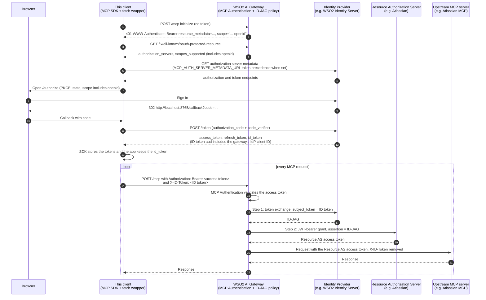

# ID-JAG sample MCP client

A small chat client for the Model Context Protocol, with a web UI and a terminal
mode, that demonstrates the **ID token** path of gateway-side [Identity Assertion Authorization Grant (ID-JAG)](https://datatracker.ietf.org/doc/draft-ietf-oauth-identity-assertion-authz-grant/)
token exchange, as implemented by the
[id-jag-token-exchange-policy](https://github.com/DinikaSen/id-jag-token-exchange-policy)
for the WSO2 AI Gateway.

It is an ordinary MCP client with one addition. It authorizes at the MCP server
the standard way: a 401 with protected resource metadata, authorization server
discovery, dynamic client registration or a pre-registered client, PKCE, and a
bearer access token on `Authorization`. Because the sign-in requests the
`openid` scope, the token response also carries an **ID token**. The client
keeps it and sends it on a second header, `X-ID-Token` by default, with every
MCP request.

Behind the gateway's MCP Authentication policy, the ID-JAG policy exchanges that
ID token at the identity provider for an ID-JAG, presents it to the upstream MCP
server's authorization server, and forwards the request with the resulting
access token. The client never sees any upstream credential.



Steps 1 to 13 are the standard MCP authorization flow, driven entirely by the
SDK; the only choice the client makes is to ask for `openid`. Steps 15 to 21
happen inside the gateway and are described in the policy's README. The
client's own code adds one header (step 14) and keeps one token (step 13).

Built on the official [MCP TypeScript SDK](https://github.com/modelcontextprotocol/typescript-sdk)
and the [Anthropic SDK](https://github.com/anthropics/anthropic-sdk-typescript).
Nothing is patched or forked.

## Prerequisites

- Node.js 20.6 or newer.
- An MCP server behind a WSO2 AI Gateway with the MCP Authentication policy and
  the ID-JAG policy attached in `id_token` mode.
- Optionally, for the chat loop, either an Anthropic proxy on the same gateway
  with an API key for it, or an Anthropic API key. Without one the client still
  connects, lists tools and calls them with `/call`.

## Authorization server setup

The authorization server is whatever the gateway's MCP Authentication policy
advertises; for this gateway that is the identity provider the ID-JAG policy
exchanges at. The client needs an application there unless dynamic client
registration is enabled:

| Setting | Value |
|---|---|
| Client type | Public (PKCE only) or confidential; both work |
| Grant types | `authorization_code`. Optionally `refresh_token`: with it the SDK renews expired tokens silently, and the ID token with them; without it an expired session goes back through the sign-in page |
| Redirect URL | `http://localhost:8765/callback` (port from `CALLBACK_PORT`) |
| Scopes | `openid`, plus whatever the MCP server requires |
| **ID token audience** | **Must include the client ID the gateway uses at this identity provider** |

The last row is what makes the exchange work. The ID-JAG specification requires
the identity provider to check that the ID token's audience matches the client
that authenticates the exchange request, and that client is the gateway. Most
identity providers let an application add extra audiences to its ID tokens; in
WSO2 Identity Server it is the application's *ID token audience* setting. Add
the gateway's identity provider client ID there.

## Gateway setup

- MCP Authentication policy attached and working. Its `requiredScopes` should
  include `openid`, so that the advertised `scopes_supported` makes every client
  request an ID token. Otherwise this client's `MCP_SCOPES` fallback only applies
  when the metadata advertises no scopes at all.
- ID-JAG policy attached after it with `assertionType: id_token`,
  `idTokenHeader` equal to `ID_TOKEN_HEADER` here, and a `credentialRef` whose
  identity provider client ID is the one you put in the ID token audience above.

## Running

```bash
npm install
cp .env.example .env     # then edit
npm run ui               # web UI on http://localhost:8765
npm start                # or: terminal mode
```

### Web UI

The UI is framed as an internal support assistant: support staff sign in with
their own identity, chat, and the assistant works the ticketing tools behind the
gateway on their behalf. It is one page served by the same process on the
callback port, so no extra build step or port.

1. Open `http://localhost:8765` and click **Sign in**. The page follows the
   authorization redirect, the identity provider signs you in, and the callback
   returns you to the page.
2. The **Session** panel shows the subject, audiences and expiry of the access
   token and the ID token, and the header the ID token is sent on. The token
   values are never sent to the browser.
3. The **Tools** panel lists what the MCP server exposes.
4. Chat in the **Conversation** pane. Tool calls and their results appear inline
   and can be expanded.
5. The **Request trace** panel shows every request to the MCP server with its
   JSON-RPC method, whether the ID token header was attached, and the status.
   Hover a 401 to see the gateway's `WWW-Authenticate` value.

The UI binds to `127.0.0.1` only and has no authentication of its own; it is a
single-user local app. Chat needs an LLM route (below); without one the session,
tools and trace panels still work.

### LLM route

The assistant's model calls can go through the gateway as well, so that both the
tool traffic and the LLM traffic of the application are governed in one place.
Set `LLM_PROXY_URL` to an Anthropic proxy on the gateway and `LLM_PROXY_API_KEY`
to an API key for it. The client sends that key on `X-API-Key`, which is the
same header the Anthropic SDK uses for its own key, so the SDK is simply pointed
at the proxy and the gateway swaps in the real Anthropic key upstream. Those
calls appear in the request trace tagged `LLM`.

When `LLM_PROXY_URL` is empty, `ANTHROPIC_API_KEY` calls Anthropic directly.

### Terminal mode

What happens:

1. A callback listener starts on `localhost:8765`.
2. The client connects to `MCP_SERVER_URL`, gets a 401 with resource metadata,
   discovers the authorization server (or uses `MCP_AUTH_SERVER_METADATA_URL`),
   registers or uses the pre-registered client, and opens the browser to sign
   in. The terminal prints the access token's and the ID token's issuer, subject,
   audiences and expiry. The tokens themselves are never printed.
3. Tools are listed. Each MCP request is logged with its JSON-RPC method, the
   header the ID token went on, and the status. A 401 shows the gateway's
   `WWW-Authenticate` value, which is where a failed exchange is diagnosed.
4. Type a message to chat, or use the commands:

```
/tools                 list the MCP server's tools
/call <tool> [json]    call a tool directly, e.g. /call search {"query":"x"}
/idtoken               show the current ID token claims
/quit                  exit
```

Set `NO_BROWSER=1` to print sign-in URLs instead of opening the browser.

## Configuration

All settings are environment variables, read from `.env` by `npm start`.
See [.env.example](.env.example) for the full list.

| Variable | Purpose |
|---|---|
| `MCP_SERVER_URL` | The MCP endpoint on the gateway |
| `MCP_CLIENT_ID`, `MCP_CLIENT_SECRET` | Empty to register dynamically; set for a pre-registered client, secret only if confidential |
| `MCP_AUTH_SERVER_METADATA_URL` | Optional authorization server metadata document that takes precedence over discovery |
| `MCP_SCOPES` | Fallback scope when neither the challenge nor the resource metadata names any; default `openid` |
| `ID_TOKEN_HEADER` | Header carrying the ID token; default `X-ID-Token` |
| `LLM_PROXY_URL`, `LLM_PROXY_API_KEY` | Chat through the gateway's Anthropic proxy; the key is sent on `X-API-Key` |
| `ANTHROPIC_API_KEY` | Chat directly against Anthropic, used only when `LLM_PROXY_URL` is empty |
| `ANTHROPIC_MODEL` | Model for either route; default `claude-sonnet-5-5` |
| `CALLBACK_PORT` | Local port for the redirect URL and the web UI; default `8765` |
| `LOG_HTTP` | `false` to silence per-request logging |

## What this client does and does not do

- Tokens live in memory for the lifetime of the process. Nothing is written to disk.
- The ID token is sent only to `MCP_SERVER_URL`, never to the authorization
  server traffic the MCP SDK generates, never logged, and never sent to the web
  UI. Only decoded claims are shown.
- The ID token is renewed together with the access token. When the gateway
  rejects a request with 401 `invalid_token`, the SDK refreshes, the refresh
  response carries a new ID token, and the request is retried. If the
  authorization server does not return an ID token on refresh, the SDK falls
  back to a new sign-in.
- PKCE is used regardless of client type, as the MCP authorization specification requires.
- No `private_key_jwt` or DPoP. The SDK supports them; they are left out to keep the sample small.

## Troubleshooting

| Symptom | Likely cause |
|---|---|
| "the token response carried no ID token" | `openid` was not in the requested scope. Check `scopes_supported` in the resource metadata and the application's allowed scopes |
| Gateway 401 `invalid_token` on every request after a successful sign-in | The identity provider rejected the exchange. Check the ID token audience includes the gateway's client ID, and the gateway's logs for the step that failed |
| Gateway 502 | The exchange with the upstream authorization server failed; see gateway logs |
| `State mismatch` in the browser | A stale callback from an earlier run; retry the sign-in |
| `GET ... -> 401` with an empty `WWW-Authenticate` in the trace | The upstream MCP server does not offer the optional server-to-client stream and answers the SDK's GET with a bare 401. The client reports it as "stream not offered" so the SDK does not start a second sign-in; the gateway could answer 405 for that GET instead |
| Self-signed TLS at the identity provider or gateway | Set `NODE_EXTRA_CA_CERTS` to the CA bundle |

## Development

```bash
npm run typecheck
npm test
```

## License

Apache License 2.0. See [LICENSE](LICENSE).
